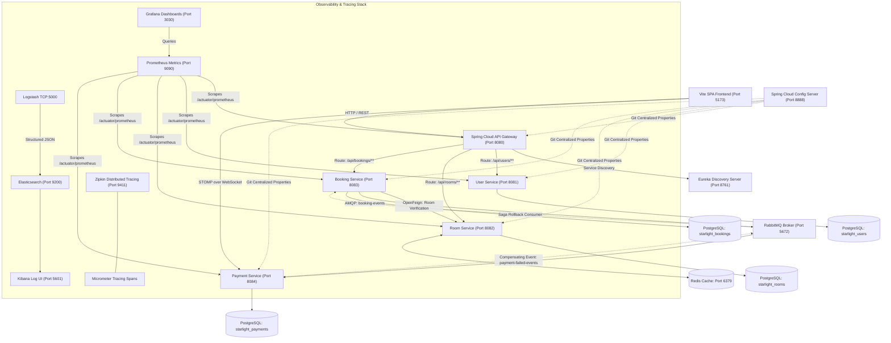

# 🌟 Starlight Stays — Enterprise Microservices Architecture & Hospitality Mesh

> **Cloud-Native Luxury Hospitality Booking Platform**  
> Engineered with Spring Boot 3, Spring Cloud, Netflix Eureka, RabbitMQ, PostgreSQL, Redis, Resilience4j, and an Observability Stack (Zipkin, Prometheus, Grafana, ELK).

---

## 1. System Architecture & Service Topology



---

## 2. Key Architecture Patterns Implemented

### 2.1 Two-Way Distributed Transactional Saga (Forward + Compensating Rollback)
1. **Forward Transaction**:
   - User submits booking modal &rarr; Gateway routes to `booking-service`.
   - `booking-service` verifies room via Feign `RoomClient`, validates overlapping dates, and persists record in `starlight_bookings` with status `CONFIRMED`.
   - `booking-service` publishes JSON message to RabbitMQ exchange `booking-events`.
   - `payment-service` consumes event, persists payment in `starlight_payments`, and broadcasts clearance via WebSocket STOMP (`/topic/payments`).
2. **Compensating Rollback (Two-Way Saga)**:
   - If payment fails (e.g., card declined or chaos simulation triggered), `payment-service` marks payment `FAILED` and dispatches a compensating event to `payment-failed-events`.
   - `booking-service` consumes the compensating event, transitions the booking from `CONFIRMED` to **`CANCELLED_PAYMENT_FAILED`**, and **instantly releases the suite dates in PostgreSQL**.

### 2.2 Redis Distributed Caching (Sub-3ms Latency)
- `room-service` leverages Spring Data Redis with `@EnableCaching`.
- Catalog reads are cached via `@Cacheable(value = "rooms", key = "'all_' + (#propertyName != null ? #propertyName : 'all')")`.
- When administrative modifications occur, the cache is automatically invalidated via `@CacheEvict(value = "rooms", allEntries = true)`.
- Reduces PostgreSQL database load and serves cached catalog queries in under 2ms.

### 2.3 Distributed Tracing (Zipkin + Micrometer Tracing)
- Full end-to-end tracing across all HTTP endpoints, OpenFeign clients, and RabbitMQ messages via `micrometer-tracing-bridge-brave` and `zipkin-reporter-brave`.
- 100% trace sampling probability (`management.tracing.sampling.probability: 1.0`).
- Open **`http://localhost:9411`** to inspect the end-to-end trace waterfall connecting Gateway, Booking, Room, and Payment spans.

### 2.4 Resilience4j Circuit Breakers & Fallback
- API Gateway protects downstream services using Resilience4j circuit breakers and filters.
- If downstream instances become slow or unavailable, requests route to graceful fallback endpoints (`/fallback/bookings`, `/fallback/rooms`, `/fallback/users`) returning `503 Service Unavailable` with clean, user-friendly JSON payloads.

---

## 3. Platform Directory & Credentials

| Service | Port / URL | Credentials | Role |
| :--- | :--- | :--- | :--- |
| **Vite SPA Frontend** | `http://localhost:5173/` | — | Reactive luxury dashboard, vouchers, reviews & KPI analytics |
| **API Gateway** | `http://localhost:8080/` | Bearer JWT | Central reverse proxy & auth filter |
| **Eureka Discovery** | `http://localhost:8761/` | — | Service mesh registry |
| **Config Server** | `http://localhost:8888/` | — | Centralized Git property management |
| **User Service** | `http://localhost:8081/` | `admin` / `password` | Authentication & RBAC profiles |
| **Room Service** | `http://localhost:8082/` | — | Catalog & Redis distributed caching |
| **Booking Service** | `http://localhost:8083/` | — | Saga orchestrator & availability engine |
| **Payment Service** | `http://localhost:8084/` | — | Transaction ledger & WebSocket broadcasts |
| **Notification Service** | `http://localhost:8085/` | — | AMQP pub-sub consumer & VIP digital vouchers |
| **Review Service** | `http://localhost:8086/` | — | Verified guest ratings (1–5★) & reviews |
| **Distributed Tracing (Zipkin)** | `http://localhost:9411/` | — | Trace timeline visualizer |
| **Metrics (Prometheus)** | `http://localhost:9090/targets` | — | Actively scraping all microservices |
| **Dashboards (Grafana)** | `http://localhost:3030/` | `admin` / `admin` | Mesh throughput, p95 latency, circuit breakers |
| **Centralized Logs (Kibana)**| `http://localhost:5601/` | — | Search structured `starlight-logs-*` |
| **RabbitMQ Management** | `http://localhost:15672/` | `guest` / `guest` | AMQP exchanges and queues |
| **PostgreSQL Database** | `localhost:5432` | `postgres` / `password` | 6 isolated database schemas |
| **Redis Cache** | `localhost:6379` | — | Room catalog distributed cache |

**Demo Account**:
- **Username**: `admin`
- **Password**: `password`

---

## 4. Quick Start & Execution

### One-Click Launch
Start the entire 18-container platform, verify dependencies, and launch the frontend with a single command:
```bash
./start-all.sh
```

### Stop Platform
Gracefully terminate all background servers and Docker containers:
```bash
./stop-all.sh
```

---

## 5. Automated Verification & Testing

Execute the comprehensive 10-suite automated test covering infrastructure, JWT security, catalog lookups, saga transactions, compensating rollbacks, cancellations, circuit breakers, observability, notification vouchers, and guest reviews:

```bash
bash "starlight-stays/comprehensive-system-test.sh"
```

**Test Suite Coverage (21 / 21 Tests Passing — 100% Pass Rate)**:
- `SUITE 1`: Eureka, Config Server, Gateway, and Vite reachability.
- `SUITE 2`: JWT login, authenticated profile access, unauthenticated request rejection.
- `SUITE 3`: PostgreSQL seeded suites and single room lookups.
- `SUITE 4`: Transactional booking creation and 409 double-booking prevention.
- `SUITE 5`: Two-way compensating saga rollback to `CANCELLED_PAYMENT_FAILED` and immediate suite date release.
- `SUITE 6`: User booking query and self-service reservation cancellation (`PUT /cancel`).
- `SUITE 7`: Resilience4j circuit breaker fallback degradation.
- `SUITE 8`: Prometheus scraper health (targets UP) and Logstash Elasticsearch indexing.
- `SUITE 9`: Notification Service & VIP digital voucher issuance via AMQP fanout.
- `SUITE 10`: Guest Reviews & Ratings Service (public read access & authenticated POST).

---

## 6. Continuous Integration & Deployment (CI/CD)

The repository includes a production-grade GitHub Actions workflow (`.github/workflows/ci.yml`) triggering on pushes and pull requests:
- **Backend Build**: Compiles all 9 microservices in parallel with Temurin JDK 17 and caches dependencies.
- **Frontend Build**: Builds the modern Vite SPA production bundle.
- **Mesh Validation**: Lints and validates `docker-compose.yml` service definitions.
- **Script Audit**: Syntax checks all operational bash orchestration scripts (`bash -n`).

