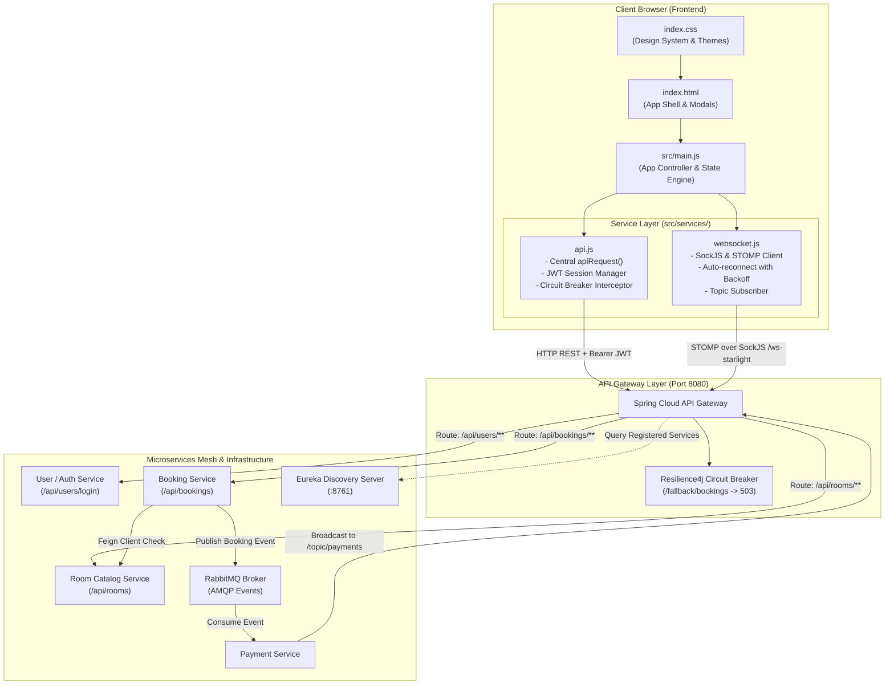
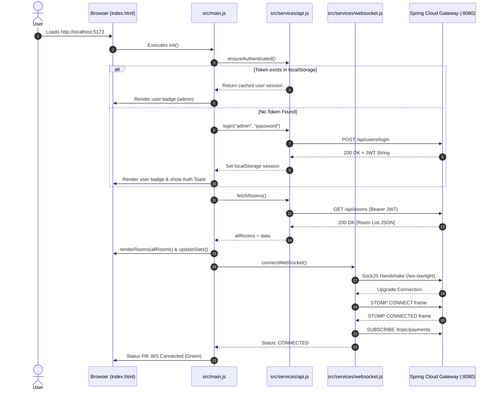
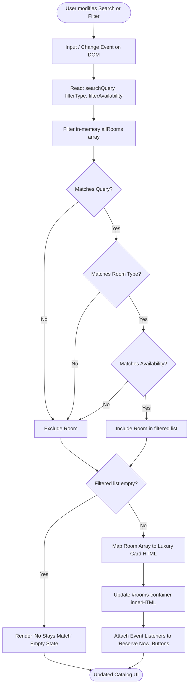
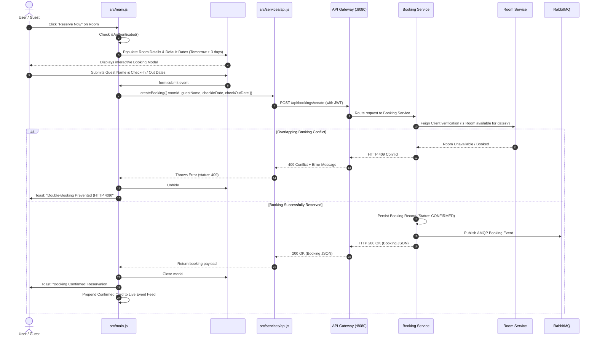
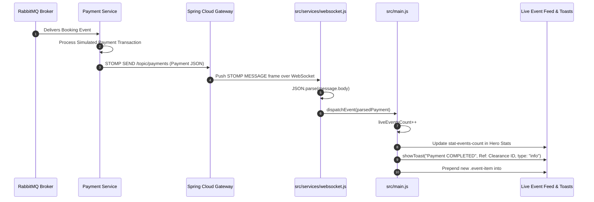
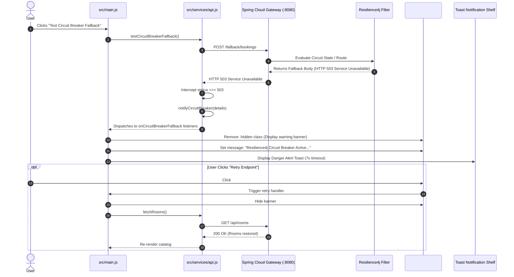

# Starlight Stays — Frontend Architecture & Workflow Documentation

## 1. Executive Summary & Architectural Vision

The **Starlight Stays Frontend** is a modern, responsive Single-Page Application (SPA) designed for luxury hospitality booking. Built with **Vite 5**, **ES6+ JavaScript modules**, **Semantic HTML5**, and **Vanilla CSS**, the frontend operates as the presentation and client-side orchestration layer within a distributed **Service-Oriented Architecture (SOA) / Spring Cloud Microservices Mesh**.

### Key Architectural Highlights
- **Zero-Heavy-Framework Overhead**: High-performance native DOM rendering without heavy virtual DOM runtimes, ensuring sub-second cold loads and minimal memory footprint.
- **Central Edge Routing**: All HTTP and WebSocket communications route exclusively through a unified **Spring Cloud API Gateway (Port 8080)**. Downstream services remain decoupled from the client.
- **Resilient Observer Architecture**: Built-in pub/sub listeners for authentication transitions, real-time STOMP payment events, and circuit breaker trip detection.
- **Graceful Fault Interception**: Native HTTP 503 / Circuit Breaker interception with active UI alerts, allowing users to probe service availability without breaking UI state.
- **Real-time Event Streaming**: Full-duplex STOMP over SockJS connection for instant payment status and clearance broadcasting.

---

## 2. Technology Stack & Directory Structure

### 2.1 Technology Stack Matrix

| Layer / Concern | Technology / Library | Purpose |
| :--- | :--- | :--- |
| **Build & Tooling** | Vite 5 (`vite`, ES Modules) | Fast HMR, development server (`:5173`), optimized asset bundling |
| **Core Client Logic** | ES6+ Vanilla JavaScript | Module-based state management, DOM manipulation, pub/sub event bus |
| **User Interface** | HTML5 + Custom Vanilla CSS | CSS Custom Properties, Glassmorphism, Flexbox/Grid layouts, Dark luxury styling |
| **Real-time Comms** | SockJS Client & STOMP.js | Fallback-capable WebSocket connection for event-driven updates |
| **Session Security** | JWT (JSON Web Tokens) | Stateless bearer token storage (`localStorage`) and automated request injection |
| **Edge Gateway** | Spring Cloud Gateway (`:8080`) | Reverse proxy, route rewriting, Resilience4j circuit breaking |

### 2.2 Directory Structure

```
frontend/
├── index.html                  # Core application shell & semantic HTML structure
├── package.json                # Project metadata, Vite dev/build scripts, dependencies
├── package-lock.json           # Pinned dependency tree
├── dist/                       # Production build output
└── src/
    ├── index.css               # Design system, CSS variables, layout, animations
    ├── main.js                 # App controller: bootstrapping, UI binding, event handlers
    ├── assets/                 # Luxury property imagery (penthouse, nebula, aurora, etc.)
    │   ├── aurora.jpg
    │   ├── nebula.jpg
    │   ├── penthouse.jpg
    │   └── waterfront.jpg
    └── services/
        ├── api.js              # Central HTTP client, JWT auth, circuit breaker interceptor
        └── websocket.js        # SockJS & STOMP client manager with exponential backoff
```

---

## 3. Component & Layer Architecture



---

## 4. Detailed Component Breakdowns

### 4.1 Application Orchestrator (`src/main.js`)
The `main.js` module coordinates presentation, state, and interaction.
- **State Management**:
  - `allRooms`: Master cache of room models loaded from the backend.
  - `liveEventsCount`: Counter tracking real-time STOMP transaction events.
  - Client-side search and multi-criteria filtering (search keywords, room type, availability).
- **Observer Hooks**:
  - Registers `onAuthStateChange` to toggle user badge/sign-in buttons.
  - Registers `onCircuitBreakerFallback` to raise the persistent resilience alert banner.
  - Registers `onPaymentEvent` to update stats, show animated toasts, and prepend live event cards.
  - Registers `onConnectionStatusChange` to update the WebSocket visual status pill (`connected`, `connecting`, `disconnected`).

### 4.2 Central API Client (`src/services/api.js`)
Encapsulates all outbound HTTP requests with interceptors:
- **JWT Injection**: Automatically appends `Authorization: Bearer <token>` to request headers if authenticated.
- **Automated JSON Parsing**: Serializes outgoing payload objects and parses incoming responses.
- **503 Circuit Breaker Interception**: Detects HTTP 503 status, notifies registered circuit breaker listeners, and throws structured errors.
- **401 Unauthorized Interception**: Clears expired tokens, resets user state, and prompts re-authentication.
- **Network Failure Fallback**: Detects network connection loss and alerts the circuit breaker listener.

### 4.3 WebSocket & STOMP Client (`src/services/websocket.js`)
Manages the real-time event pipeline:
- Connects to `http://localhost:8080/ws-starlight` using SockJS.
- Initializes STOMP over the SockJS transport.
- Subscribes to `/topic/payments`.
- **Fault-Tolerant Reconnect**: Uses exponential backoff ($1000 \times 1.5^{\text{attempts}}$ capped at 10s) for up to 10 retry attempts on connection drops.

---

## 5. End-to-End Workflow Flowcharts

### Workflow 1: Application Bootstrapping & Lifecycle



---

### Workflow 2: Room Browsing, Search, and Filtering



---

### Workflow 3: Reservation Creation & Conflict Handling (HTTP 409)



---

### Workflow 4: Real-time Payment Event Streaming (STOMP / SockJS)



---

### Workflow 5: Resilience4j Circuit Breaker Interception & Fallback



---

## 6. Resilience & Security Mechanisms

### 6.1 Security Architecture
- **Stateless Bearer Tokens**: User credentials authenticate against `/api/users/login`, returning signed JWTs stored in `localStorage` under `starlight_jwt_token`.
- **Automatic Token Propagation**: Every downstream call initiated via `apiRequest()` injects the header:
  ```http
  Authorization: Bearer <starlight_jwt_token>
  ```
- **Proactive 401 Eviction**: Upon receiving an HTTP 401 Unauthorized response from any service, the frontend clears storage, invokes `notifyAuthChange(null)`, and pops the login modal to prevent unauthorized stale requests.

### 6.2 Resilience & Fault Handling
- **Non-Blocking 503 Interception**: Rather than crashing the application or showing broken UI fragments, 503 responses trigger a dedicated pub/sub channel displaying an informative status ribbon at the top of the viewport.
- **SockJS Transport Fallback**: If raw WebSockets are blocked by proxies or firewalls, SockJS smoothly falls back to HTTP long-polling or streaming without application reconfiguration.
- **Bounded Exponential Reconnect**: Prevents frontend reconnect storms against recovering brokers by throttling reconnect intervals exponentially up to 10 seconds.

---

## 7. Operational & Verification Guide

### 7.1 Running the Frontend Locally
```bash
# Navigate to the frontend workspace
cd frontend

# Install required dependencies
npm install

# Start the Vite development server (Port 5173)
npm run dev
```

### 7.2 Microservice Connectivity Verification Checklist
| Test Case | Expected Frontend Reaction |
| :--- | :--- |
| **Gateway Reachability** | Header pill displays `Gateway: 8080` and room catalog renders 6 suites. |
| **WebSocket Connection** | Header pill toggles to `WS: Connected` (green dot) upon STOMP handshake. |
| **Auth Flow** | Login modal validates credentials; user badge displays `admin`. |
| **Double Booking (409)** | Reserving already booked dates flags the room with a red conflict alert box. |
| **Circuit Breaker (503)** | Clicking "Test Circuit Breaker" displays the top Resilience4j warning banner. |
| **RabbitMQ Simulation** | Dispatching AMQP event triggers a real-time card in the live event feed. |
