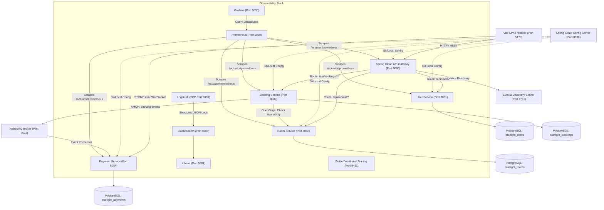

# 🌟 Starlight Stays — Architecture & Final Submission Documentation

**Platform Overview**: Starlight Stays is an enterprise-grade luxury hospitality booking platform engineered with a Spring Cloud microservices mesh, event-driven transactional saga pattern, centralized observability, and modern reactive frontend.

---

## 1. System Architecture & Topology



---

## 2. API Route Reference

All external client traffic routes through the API Gateway on `http://localhost:8080`.

### 2.1 User Service (`/api/users/**` -> `lb://user-service`)

| Method | Gateway Endpoint | Target Service Endpoint | Auth Required | Description |
| :--- | :--- | :--- | :--- | :--- |
| `POST` | `/api/users/register` | `POST /users/register` | **No** (Public) | Registers a new user account. Returns user ID & details. |
| `POST` | `/api/users/login` | `POST /users/login?username={u}&password={p}` | **No** (Public) | Authenticates credentials and returns raw JWT Bearer token string. |
| `GET` | `/api/users/profile` | `GET /users/profile` | **Yes** (Bearer) | Retrieves the profile for the authenticated username. |

#### Authentication Example
```bash
curl -X POST "http://localhost:8080/api/users/login?username=admin&password=password"
# Response: eyJhbGciOiJIUzI1NiJ9.eyJzdWIiOiJhZG1pbiIs...
```

---

### 2.2 Room Service (`/api/rooms/**` -> `lb://room-service`)

| Method | Gateway Endpoint | Target Service Endpoint | Auth Required | Description |
| :--- | :--- | :--- | :--- | :--- |
| `GET` | `/api/rooms` | `GET /rooms` | Optional / Public | Returns list of all luxury suites with pricing, capacity, and status. |
| `GET` | `/api/rooms/{id}` | `GET /rooms/{id}` | Optional / Public | Returns a single room by numeric ID. |
| `GET` | `/api/rooms/check-availability` | `GET /rooms/check-availability?roomId={id}&checkInDate={d1}&checkOutDate={d2}` | Optional / Public | Validates date availability for booking engine. |
| `POST` | `/api/rooms` | `POST /rooms` | **Yes** (ROLE_ADMIN) | Creates or updates room inventory record. |

#### Fetch Inventory Example
```bash
curl -s http://localhost:8080/api/rooms
```
**Sample JSON Response**:
```json
[
  {
    "id": 1,
    "roomNumber": "101",
    "category": "DELUXE_SUITE",
    "pricePerNight": 450.00,
    "status": "AVAILABLE",
    "description": "Panoramic ocean view with private plunge pool and marble bath.",
    "capacity": 2
  },
  {
    "id": 2,
    "roomNumber": "201",
    "category": "PRESIDENTIAL_SUITE",
    "pricePerNight": 1200.00,
    "status": "AVAILABLE",
    "description": "Penthouse sanctuary with 360-degree skyline vistas and private butler service.",
    "capacity": 4
  }
]
```

---

### 2.3 Booking Service (`/api/bookings/**` -> `lb://booking-service`)

| Method | Gateway Endpoint | Target Service Endpoint | Auth Required | Description |
| :--- | :--- | :--- | :--- | :--- |
| `POST` | `/api/bookings` | `POST /bookings` | **Yes** (Bearer) | Creates a booking, verifies room via Feign, saves record, and publishes saga event to RabbitMQ. |
| `POST` | `/api/bookings/create` | `POST /bookings/create` | **Yes** (Bearer) | Alias endpoint maintaining backward compatibility. |
| `GET` | `/api/bookings/user-bookings`| `GET /bookings/user-bookings` | **Yes** (Bearer) | Returns all bookings matching the authenticated user. |
| `GET` | `/api/bookings/user/{name}` | `GET /bookings/user/{name}` | **Yes** (Bearer) | Retrieves bookings by guest name. |

#### Create Booking Request
```bash
curl -X POST "http://localhost:8080/api/bookings" \
  -H "Authorization: Bearer <TOKEN>" \
  -H "Content-Type: application/json" \
  -d '{
    "roomId": 2,
    "guestName": "Alexander Sterling",
    "checkInDate": "2026-10-01",
    "checkOutDate": "2026-10-05",
    "guestCount": 2
  }'
```
**Response (201 Created)**:
```json
{
  "id": 14,
  "roomId": 2,
  "guestName": "Alexander Sterling",
  "checkInDate": "2026-10-01",
  "checkOutDate": "2026-10-05",
  "status": "CONFIRMED",
  "totalPrice": 4800.0,
  "guestCount": 2,
  "createdAt": "2026-09-14T07:55:00"
}
```

*Note*: If overlapping dates exist for the same room, returns `409 Conflict` with error body `{"error": "Room is already booked for the selected dates."}`.

---

### 2.4 Resilience4j Circuit Breaker Fallback Routes

When downstream services breach error rate or response latency thresholds, the API Gateway circuit breaker trips and routes traffic to graceful degradation handlers:

| Method | Gateway Endpoint | Fallback Trigger | Response Code | Default Fallback Payload |
| :--- | :--- | :--- | :--- | :--- |
| `*` | `/fallback/bookings` | Booking Service outage / timeout | `503 Service Unavailable` | `{"error": "The Booking Service is temporarily offline. Please try again shortly."}` |
| `*` | `/fallback/rooms` | Room Service outage / timeout | `503 Service Unavailable` | `{"error": "The Room Service is currently unavailable."}` |
| `*` | `/fallback/users` | User Service outage / timeout | `503 Service Unavailable` | `{"error": "The User Service is currently unavailable."}` |

---

## 3. JWT Bearer Token Security Specification

### 3.1 Authentication Workflow
1. Client requests token via `POST /api/users/login?username={}&password={}`.
2. User Service validates password (BCrypt) and generates a signed HMAC-SHA256 JWT containing `sub`, `roles`, and expiry.
3. Client passes token on every authenticated request in the HTTP Header:
   ```http
   Authorization: Bearer <JWT_TOKEN>
   ```
4. API Gateway (`JwtAuthenticationFilter.java` & `JwtGlobalAuthenticationFilter.java`) validates signature against `${JWT_SECRET}`.
5. Injected request headers:
   - `X-User-Id`
   - `X-User-Role`

### 3.2 Public vs Protected Route Policy
- **Bypassed / Public Endpoints**:
  - `/api/users/login`, `/api/users/register`
  - `/fallback/**`
  - `/actuator/**`
  - `/ws-starlight/**` (WebSocket handshake)
- **Protected Endpoints**:
  - `/api/bookings/**` (Requires valid Bearer token)
  - `/api/users/profile` (Requires valid Bearer token)
  - `POST /api/rooms` (Requires valid Bearer token + Admin authority)

---

## 4. WebSocket & STOMP Topic Schemas

### 4.1 Connection Details
- **Protocol**: STOMP over SockJS / WebSocket
- **Handshake URL**: `ws://localhost:8080/ws-starlight` (or `http://localhost:8080/ws-starlight` via SockJS fallback)
- **Direct Service URL**: `ws://localhost:8084/ws-starlight`

### 4.2 Subscription Topics

#### `/topic/payments`
Broadcast when Payment Service consumes a `booking-events` AMQP message, executes the charge against the virtual ledger, and persists payment record.

**Payload Schema**:
```json
{
  "paymentId": 7,
  "bookingId": 14,
  "amount": 4800.0,
  "status": "SUCCESS",
  "paymentMethod": "AUTO_SETTLEMENT",
  "transactionTimestamp": "2026-09-14T07:55:01.120Z"
}
```

### 4.3 Transactional Saga Event Flow
1. **Initiation**: User submits booking modal in frontend -> `POST /api/bookings`.
2. **Local Commit**: `booking-service` verifies room via Feign, inserts row in `starlight_bookings` with status `CONFIRMED`.
3. **Event Publication**: `booking-service` sends message to RabbitMQ exchange `booking-events`:
   ```json
   {
     "bookingId": 14,
     "guestName": "Alexander Sterling",
     "amount": 4800.0,
     "status": "CONFIRMED"
   }
   ```
4. **Asynchronous Processing**: `payment-service` listens on queue `booking-events-queue`, verifies funds, creates `Payment` entity in `starlight_payments`.
5. **Real-time Push**: `payment-service` calls `simpMessagingTemplate.convertAndSend("/topic/payments", paymentEvent)`.
6. **Frontend Real-time UI**: Client STOMP listener receives event, animates live pipeline timeline with confirmation ID, and updates the inventory badge.

---

## 5. Observability, Metrics & Centralized Logging

### 5.1 Prometheus Actuator Scraper
Configured via `prometheus.yml`:
- Scrapes all 5 microservices on interval `5s`:
  - `api-gateway:8080/actuator/prometheus`
  - `user-service:8081/actuator/prometheus`
  - `room-service:8082/actuator/prometheus`
  - `booking-service:8083/actuator/prometheus`
  - `payment-service:8084/actuator/prometheus`
- Accessible at `http://localhost:9090`.

### 5.2 Grafana Dashboards
- **URL**: `http://localhost:3030` (Credentials: `admin` / `admin`)
- **Provisioned Dashboard**: `Starlight Stays - Microservice Mesh Dashboard`
  - Live HTTP Throughput (req/sec)
  - HTTP 95th Percentile Response Latency (`http_server_requests_seconds`)
  - JVM Heap & Non-Heap Memory Distribution
  - Resilience4j Circuit Breaker Trip States (`resilience4j_circuitbreaker_state`)

### 5.3 Centralized JSON Logging (ELK Stack)
- Microservices stream structured log events via `logstash-logback-encoder` over TCP to `logstash:5000`.
- Logstash filters pipeline and ships documents directly to Elasticsearch:
  - **Index Pattern**: `starlight-logs-%{+YYYY.MM.dd}`
  - **Kibana UI**: `http://localhost:5601` for search, filtering by `service_name`, log level, and stack traces.

---

## 6. End-to-End Resilience & Chaos Test Verification

The platform includes an automated chaos test suite at `chaos-resilience-test.sh`.

```bash
bash "/home/nsg/Projects/soa project/starlight-stays/chaos-resilience-test.sh"
```

**Verification Results Summary**:
- **Phase 1: Baseline Health & Auth**: `POST /api/users/login` generates JWT; `GET /api/rooms` retrieves 6 active database records.
- **Phase 2: Concurrency & Double Booking**: Prevents date conflicts with `HTTP 409 Conflict`.
- **Phase 3: Chaos Broker Downtime**: Pauses `rabbitmq` container (`docker pause rabbitmq`). Booking transaction safely completes locally and persists with fault tolerance. Container restored seamlessly.
- **Phase 4: Circuit Breaker Fallback**: Gateway trips to `/fallback/bookings` with clean `HTTP 503` user notification.
- **Phase 5: Observability Verification**: Confirms all 5 Prometheus targets are active and 700+ structured logs indexed in Elasticsearch.
